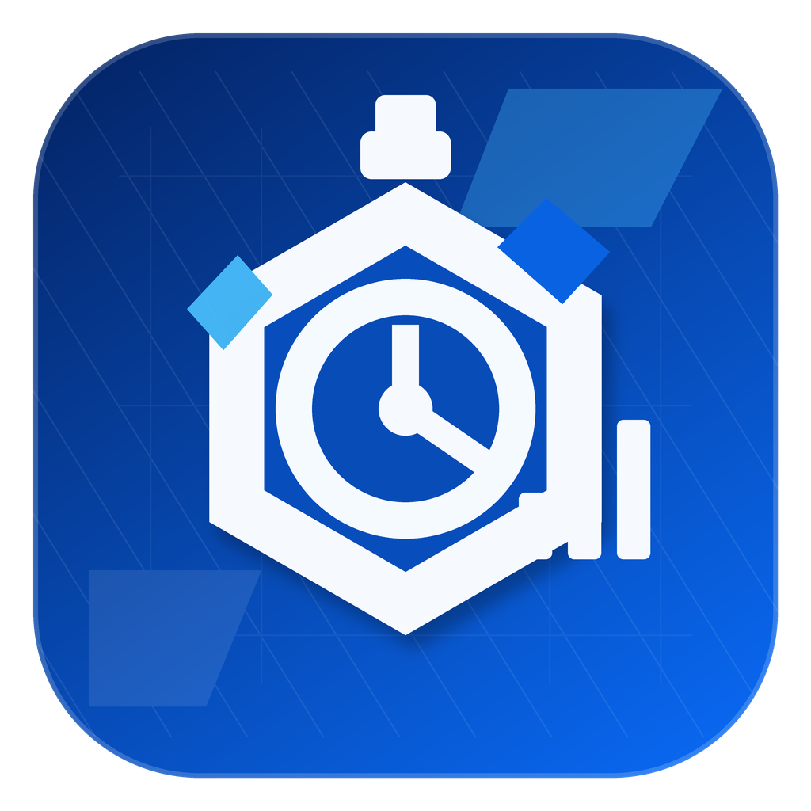
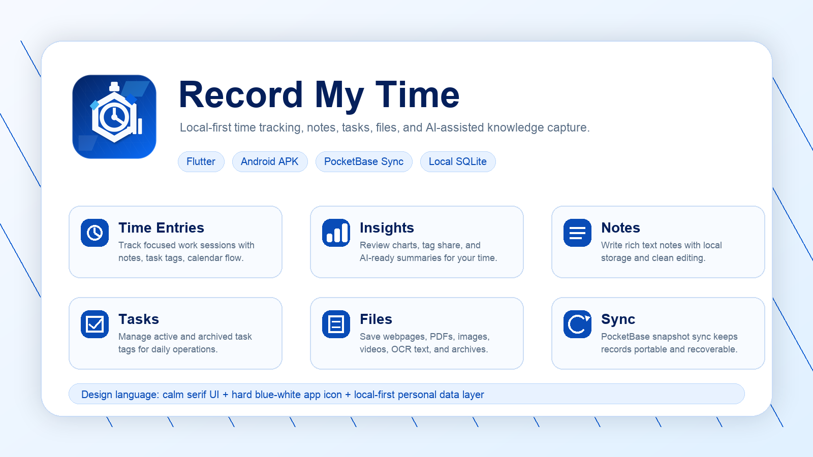

# Record My Time

<p align="center">
  
</p>

<p align="center">
  一个本地优先的时间记录、任务标签、富文本笔记、文件知识库与 AI 辅助整理工具。
</p>

<p align="center">
  <strong>Flutter</strong> · <strong>Android</strong> · <strong>macOS</strong> · <strong>SQLite</strong> · <strong>PocketBase Sync</strong>
</p>



## 项目定位

Record My Time 不是单纯的打卡工具。它把“今天做了什么”“这些事情属于哪个长期方向”“过程里产生了哪些笔记和材料”“这些材料能否被重新检索和总结”放在同一个本地优先的工作流里。

核心思路：

- 时间记录负责保留行动轨迹。
- 任务标签负责建立分类体系。
- 统计页负责复盘时间流向。
- 笔记页负责沉淀想法。
- 文件页负责保存网页、PDF、图片、视频和文本材料。
- AI 能力负责在已有记录和材料上做总结、计划、问答和写作辅助。
- PocketBase 同步负责把本地数据备份到个人服务端。

## 已实现功能总览

| 模块 | 已实现功能 |
| --- | --- |
| 时间记录 | 新增记录、记录时长或次数、关联任务标签、填写备注、查看今日概览、长按选择并批量删除。 |
| 任务标签 | 创建标签、选择颜色、重命名、调整顺序、归档、恢复、提醒、AI 计划建议。 |
| 统计洞察 | 日/周视图、日期选择、总记录数、总时长、标签占比饼图、时间线、AI 复盘建议。 |
| 富文本笔记 | 新建、编辑、自动保存、富文本格式、归档、恢复、批量删除、AI 写作、插入 AI 结果。 |
| 文件知识库 | 导入网页、文本、PDF、图片、视频和任意文件；搜索；标签管理；归档/恢复；文件详情；OCR；PDF 文本提取；网页 Markdown 快照；实时网页抓取；AI 问答。 |
| 设置 | PocketBase 登录/注册/退出、同步配置、界面语言切换、AI Base URL / Model / API Key 配置、版本显示。 |
| 平台能力 | Android 分享入口、Android 本地通知、macOS 网络同步权限、SQLite 本地存储。 |

## 主界面导航

应用入口是 `lib/main.dart`。界面会根据屏幕宽度自动切换导航方式：

- 宽度大于等于 `700px`：使用侧边 `NavigationRail`。
- 宽度小于 `700px`：使用底部 `BottomNavigationBar`。

当前主要页面：

1. 记录：时间条目和今日概览。
2. 统计：日/周复盘和图表。
3. 笔记：富文本笔记本。
4. 任务：任务标签管理。
5. 文件：本地知识库。
6. 设置：同步、语言和 AI 配置。

## 时间记录

时间记录页是应用的主工作台，用来快速记录你已经完成的事情。

### 可以记录什么

每条记录包含：

- 标题/描述：这次做了什么。
- 时长：小时和分钟。
- 任务标签：例如 Work、Study、Leisure 或自定义标签。
- 备注：额外上下文。
- 时间戳：自动记录创建时间。

如果时长填写为 `0 小时 0 分钟`，记录会被视为“次数型记录”；否则会被视为“时长型记录”。

### 如何使用

1. 点击记录页右下角添加按钮。
2. 填写记录描述。
3. 选择任务标签。
4. 填写小时/分钟，也可以留为 0 来记录一次事件。
5. 可选填写备注。
6. 保存后，记录会出现在时间线中。

### 选择和删除

- 长按记录可进入选择模式。
- 选择多个记录后可以批量删除。
- 点击记录卡片可查看详情，包括标签、时间、时长和备注。

## 任务标签

任务标签是 Record My Time 的分类基础。时间记录、统计图表和 AI 计划都依赖标签。

### 已实现能力

- 创建任务标签。
- 给标签选择颜色。
- 重命名标签。
- 修改标签颜色。
- 调整活跃标签顺序。
- 归档不再使用的标签。
- 从归档区恢复标签。
- 发送本地提醒通知。
- 根据当前标签和历史用时生成 AI 计划建议。

### 推荐用法

- 把标签设计成稳定的长期分类，例如 `工作`、`学习`、`阅读`、`运动`、`家务`。
- 不建议把标签做得太细。具体事项放在时间记录标题里，分类放在标签里。
- 已经不用的标签优先归档，而不是删除，这样历史记录的分类语义更完整。

### AI 计划

任务页的 AI 计划会读取：

- 活跃标签的记录次数。
- 活跃标签累计时长。
- 归档标签概况。

AI 输出包含：

- 任务优先级排序。
- 今天或下一工作段的推荐安排。
- 哪些标签需要拆分、合并或新增。
- 每条建议背后的理由。

使用前需要先在设置页配置 AI API Key。

## 统计洞察

统计页用于复盘一段时间里精力实际流向哪里。

### 视图模式

- 日视图：查看某一天的记录、时长、标签占比和时间线。
- 周视图：查看某一周的总量和结构。

### 图表和指标

统计页已经实现：

- 总记录数。
- 总追踪时间。
- 标签占比饼图。
- 标签统计明细。
- 每日/每周时间线。
- 可点击饼图区域查看标签详情。

### AI 日程洞察

AI 洞察会基于当前筛选范围内的记录生成：

- 主要时间流向。
- 精力和节奏观察。
- 可执行的改进建议。
- 明日或下一阶段计划建议。

如果当前范围内没有记录，应用会提示先添加记录再请求 AI。

## 富文本笔记

笔记模块适合保存复盘、灵感、会议记录、阅读摘录和 AI 生成内容。

### 已实现能力

- 创建新笔记。
- 编辑已有笔记。
- 富文本编辑，基于 `flutter_quill`。
- 根据标题或正文自动生成标题。
- 返回时自动保存未保存内容。
- 笔记列表展示标题、正文预览和更新时间。
- 长按进入选择模式并批量删除。
- 归档笔记。
- 查看归档笔记并恢复。
- AI 写作辅助。

### AI 写作

在笔记编辑器中可以打开 AI 写作面板。它会读取：

- 当前笔记标题。
- 当前笔记正文。
- 用户输入的写作指令。

常见用法：

- “请续写这篇笔记，保持原有语气。”
- “请把这篇笔记整理成条目。”
- “请提取行动项。”
- “请改写得更简洁。”

AI 返回后，可以一键插入到当前笔记。

## 文件知识库

文件页是当前项目里信息密度最高的模块，用来把外部材料保存到本地知识库。

### 支持的条目类型

| 类型 | 支持情况 |
| --- | --- |
| 网页 | 输入 URL 后下载网页，提取正文并保存为 Markdown 快照。 |
| 文本 | 直接输入标题和内容，保存为 Markdown 文本条目。 |
| PDF | 保存原文件，并提取可选择文本为 Markdown。 |
| 图片 | 保存图片，并通过 ML Kit OCR 生成可搜索 Markdown。 |
| 视频 | 保存视频文件，可在详情页预览或外部打开。 |
| 通用文件 | 保存文件，可通过系统默认应用打开。 |

### 导入方式

文件页右下角添加按钮提供三种入口：

1. 添加网页：输入 URL，应用会尝试下载网页并生成 Markdown 快照。
2. 添加文本：输入标题和正文，保存为本地 Markdown。
3. 添加文件：从系统文件选择器导入一个或多个文件。

Android 上还支持系统分享入口：

- 分享 URL 到应用，会自动进入文件库并保存为网页。
- 分享普通文本，会保存为文本条目。
- 分享文件，会导入为文件库条目。

### 文件列表用法

文件列表已经优化为更清晰的知识库视图：

- 顶部可在“当前”和“归档”之间切换。
- 搜索框支持搜索标题、标签、网页、文本和可读取内容。
- 标签 chip 可快速筛选。
- “管理标签”集中处理标签创建、重命名和删除。
- 文件卡片展示标题、来源、正文预览、更新时间和标签。
- 长按文件进入批量选择。
- 批量选择后可以询问 AI、归档、恢复或删除。

### 标签管理

文件标签独立于任务标签，用于组织知识材料。

可以：

- 创建新标签。
- 给单个文件设置多个标签。
- 按标签筛选文件。
- 重命名标签。
- 删除标签。

删除标签只会从文件中移除标签关系，不会删除文件本身。

### 归档和恢复

文件支持归档，不再需要的材料可以移入归档区。

- 当前视图中可以归档文件。
- 归档视图中可以恢复文件。
- 删除文件会同时删除本地保存的文件和对应 Markdown/OCR 快照。

### 文件详情页

点击文件卡片进入详情页。不同文件类型有不同能力：

- 网页：查看 Markdown 快照或实时网页。
- 网页快照：可以从网络重新下载并更新 Markdown。
- 实时网页：页面加载后可以抓取当前 DOM 正文为 Markdown。
- 图片：查看原图或 OCR 文本。
- 图片 OCR：支持中文+英文、日文+英文、英文三种识别模式。
- PDF：查看 PDF 文件入口或 Markdown 文本。
- 视频：内置视频预览，失败时可外部打开。
- 通用文件：显示无法预览提示，并提供外部打开。

详情页常用操作：

- 重命名文件。
- 打开来源。
- 外部打开本地文件。
- 更新网页 Markdown。
- 更新 OCR 文本。

### 文件 AI 问答

在文件列表中选择一个或多个文件后，可以点击“询问”打开 AI 问答面板。

可用于 AI 的材料包括：

- 文本条目。
- 网页 Markdown。
- PDF 提取文本。
- 图片 OCR Markdown。

不适合直接问答的文件，例如普通视频或没有文本快照的通用文件，会被跳过。

内置快捷问题：

- 总结文章。
- 提取要点。
- 列行动项。
- 生成摘要笔记。

AI 回答可以保存到笔记模块，形成从文件材料到笔记沉淀的闭环。

## 设置

设置页包含同步、语言和 AI 服务配置。

### 同步设置

同步使用 PocketBase，默认服务端配置在代码中指向：

```text
http://8.130.183.120:8090/
```

同步集合：

```text
sync_records
```

集合字段：

```text
owner
entity_type
local_id
payload_json
updated_at
deleted_at
```

设置页支持：

- 输入服务器地址。
- 输入用户名和密码。
- 保存配置。
- 登录已有账户。
- 注册并登录新账户。
- 退出登录。

登录后自动同步会启用。应用在多个页面加载时也会触发后台同步。

### 界面语言

界面语言支持：

- 中文。
- 英文。
- 日文。

注意：AI 预置提示词目前主要保持中文，以便获得更稳定的中文输出。

### AI 服务

AI 设置包括：

- AI Base URL。
- 模型名称。
- API Key。

默认服务说明为 DeepSeek。AI 能力被用于：

- 统计洞察。
- 任务计划。
- 笔记写作。
- 文件问答。

如果没有配置 API Key，请求 AI 时应用会提示先在设置中添加。

## 数据与本地存储

应用以本地优先为原则，主要数据存在 SQLite 中。

核心表：

- `time_events`：时间记录。
- `todo_items`：任务标签。
- `notes`：富文本笔记。
- `file_items`：文件知识库条目。
- `file_tags`：文件标签。
- `file_item_tags`：文件与标签关系。
- `deleted_records`：同步删除记录。

文件知识库还会在应用文档目录中保存原文件、Markdown 快照和 OCR 文本。

## 平台说明

### Android

Android 是当前主要目标平台。

已实现：

- APK 构建。
- 系统分享导入。
- 文件选择器导入。
- 本地通知。
- Android launcher icon。

当前 APK 输出位置：

```text
build/app/outputs/flutter-apk/app-release.apk
```

### macOS

macOS 可构建桌面版本，但有几个注意事项：

- PocketBase 同步需要 entitlement 开启 `com.apple.security.network.client`。
- 通知权限不会自动授予，需要用户确认。
- SQLite 使用原生 sqflite，不需要 FFI 初始化。
- 构建需要完整 Xcode，而不只是 Command Line Tools。

## 设计语言

界面采用：

- Material 3。
- NotoSerif / NotoSerifSC 字体。
- 米白背景。
- 墨绿主色。
- 铜色和钢蓝作为辅助色。
- 卡片半径控制在轻量范围内。

启动图标采用蓝白硬朗科技风：

<p align="center">
  
</p>

源图标：

```text
assets/app_icon.png
```

同步 Android 各密度图标：

```bash
dart run flutter_launcher_icons
```

本仓库还同步维护了 `ic_launcher_round.png` 与 `ic_launcher_foreground.png`，避免部分 Android 启动器显示旧图标。

## 项目结构

```text
lib/
  main.dart                         # 应用入口与自适应导航
  app_info.dart                     # 应用名称与展示版本
  models/                           # TimeEvent / TodoItem / NoteItem / FileItem 等模型
  screens/
    event_list_screen.dart          # 时间记录主界面
    statistics_screen.dart          # 图表与统计洞察
    todo_screen.dart                # 任务标签管理
    note_list_screen.dart           # 笔记列表
    note_editor_screen.dart         # 富文本笔记编辑
    files_screen.dart               # 文件知识库列表
    file_detail_screen.dart         # 文件详情、OCR、网页快照、外部打开
    settings_screen.dart            # 同步、AI、偏好设置
    welcome_screen.dart             # 首次启动引导
  utils/
    local_database.dart             # SQLite 数据库单例
    persistence.dart                # 时间记录 CRUD
    todo_persistence.dart           # 任务标签 CRUD
    note_persistence.dart           # 笔记 CRUD
    file_library_service.dart       # 文件导入、标签、归档、OCR、网页抓取
    cloud_sync_service.dart         # PocketBase 双向同步
    pocketbase_auth_service.dart    # PocketBase 登录和 token 管理
    ai_service.dart                 # AI 请求封装
    notification_service.dart       # 本地通知
  theme/app_theme.dart              # Material 3 主题与色彩
assets/
  app_icon.png                      # 启动图标源图
  readme_overview.png               # README 功能总览图
```

## 开发和构建

安装依赖：

```bash
flutter pub get
```

静态分析：

```bash
flutter analyze
```

运行 Android：

```bash
flutter run -d android
```

运行 macOS：

```bash
flutter run -d macos
```

构建 Android APK：

```bash
flutter build apk
```

构建 macOS：

```bash
flutter build macos
```

## 版本管理

版本号需要同时维护两个位置：

```text
pubspec.yaml      version: X.Y.Z+N
lib/app_info.dart appVersion = 'X.Y'
```

当前应用展示版本：

```text
6.0
```

## 开发约定

- 不使用代码生成。
- 不使用额外状态管理库，主要使用 `StatefulWidget` + `setState`。
- `intl` 固定为 `0.20.2`，用于兼容 `flutter_quill`。
- 图标源图为 `assets/app_icon.png`。
- Android adaptive icon 尺寸目前有手动同步资源。
- 旧 React/Capacitor 项目位于上级目录的 `recordmytime/`，当前 Flutter 开发集中在 `FlashRecording/`。

## 验证状态

最近验证命令：

```bash
flutter analyze
flutter build apk
```

已知情况：

- `flutter analyze` 通过。
- `flutter build apk` 可生成 release APK。
- 当前没有有效测试套件；`flutter test` 可以运行，但项目没有配置有意义的自动化测试。
- 构建时可能出现 Flutter 对 Gradle/Kotlin 未来版本兼容性的提醒，当前不影响 APK 产出。
